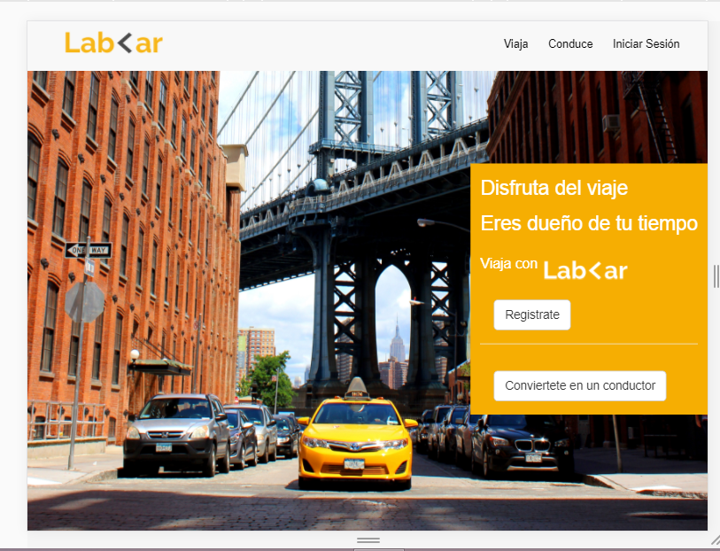
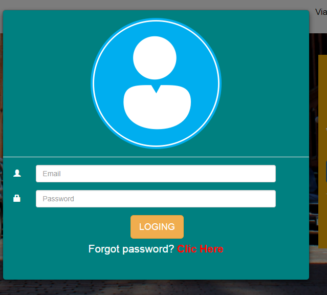
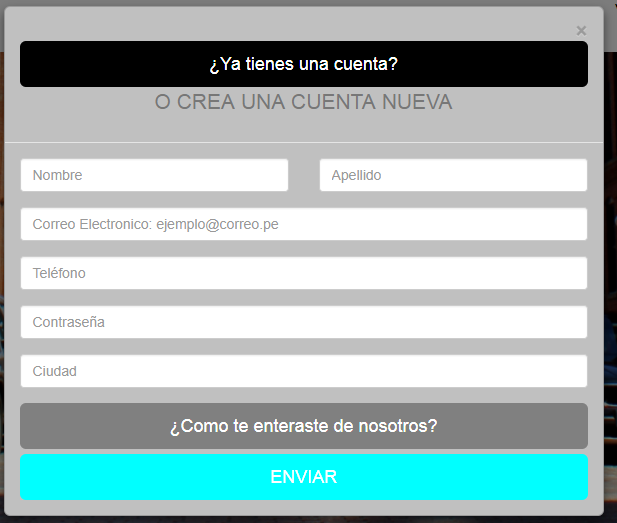
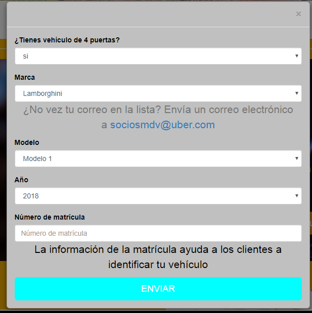

# LAB-CART

## Objetivos
El presente trabajo tiene como objetivo
- Hacer uso de la documentacion de Boostrap adaptando en distintos dispositivos, en este caso: desktop y mobile

## MOBIL

## DESKTOP

## MODALES
- MODAL INICIAR SESION

- MODAL REGISTRATE

- MODAL CONDUCE

